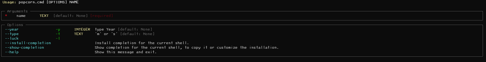

### 🍿🍿🍿 Popcorn Show CLI 🍿🍿🍿

[](https://popcornshow-cli.readthedocs.io/en/latest/?badge=latest)
[](https://github.com/icaronunes/popcornshow-cli/actions/workflows/ci.yml)
[](https://codecov.io/gh/icaronunes/popcornshow-cli)

CLI com o objetivo de obter informações sobre filmes/séries e pessoas envolvidas na produção via terminal.
Apresentando as informações mais relevantes diretamente no seu terminal.

- nome
- link para streming
- datas
- elenco/produção
- trailer
- notas do IMDB
- sinopse

possibilidade de navegar entre pessoas e obras

## Instalação

```` bash
pip install popcornshow
````
## Prints

**Busca** 


**Filmes**
  

**Séries**
  

**Pessoa**
ci

## Comandos para usar

* `popcornshow [nome do filme ou serie]` - Busca por uma lista que corresponde a texto enviada.
* `popcornshow --year -y [2000]` - Busca por uma midia com esse ano de lançamento.
* `popcornshow --type -t [m] [s]` - Busca por apenas o tipo escolhido. Filme ou Série.
* `popcornshow  -l --luck` - Retorna/escolhe a primeira opção retornada pela busca.
* `popcornshow -h` - Mostra a tela de Ajuda padrão.

* em cada tela, pode haver uma opção de navegação



## Sobre
Documentação do [ReadTheDocs](https://popcornshow-cli.readthedocs.io/en/latest/?)


Aplicação feita 100% em python

Informações obtidas do site [RealGood](https://reelgood.com/)

Há uma versão mais completa para Android: [play.google.com/popcornshow](https://play.google.com/store/apps/details?id=br.com.icaro.filme) 
