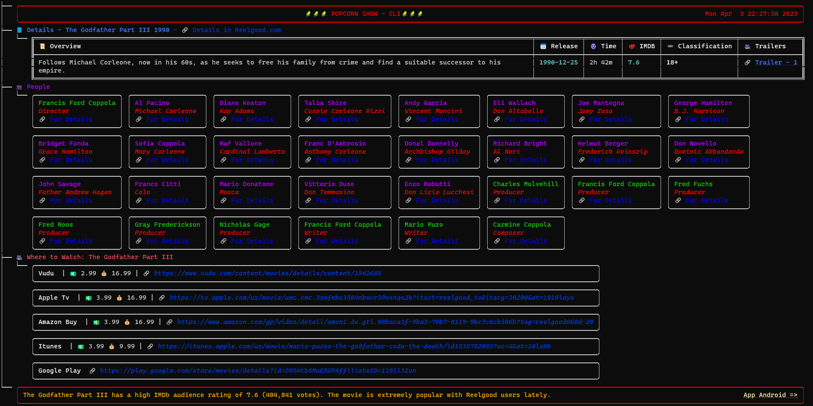

# Bem-Vindo ao PopCorn Show Cli
:corn: :corn: :corn: :corn: :corn: :corn: :corn: :corn: :corn: :corn:
##  Versão Android visite: [play.google.com/popcornshow](https://play.google.com/store/apps/details?id=br.com.icaro.filme) 


## Instalação
``` bash
pip install popcornshow
```

## Comandos para usar

* `popcornshow [nome do filme ou serie]` - Busca por uma lista que corresponde a texto enviada.
* `popcornshow --year -y [2000]` - Busca por uma midia com esse ano de lançamento.
* `popcornshow --type -t [m] [s]` - Busca por apenas o tipo escolhido. Filme ou Série.
* `popcornshow  -l --luck` - Retorna/escolhe a primeira opção retornada pela busca.
* `popcornshow -h` - Mostra a tela de Ajuda padrão.

* em cada tela, pode haver uma opção de escolha para detalhes

## Exemplos de uso

```bash 
popcornshow 'lost'
popcornshow 'lost' --year 2004
popcornshow 'lost' -type s    
popcornshow 'lost' --luck
```

# Informações retornadas
- Titulo
- Nota IMDB
- Pessoas do Filme/Série
- Detalhes sobre atores
- Descrição
- Lançamento
- Classificação
- Trailers
- Onde assistir

# Telas
### Busca 


### Filmes
  
  
### Séries
  

### Pessoa

